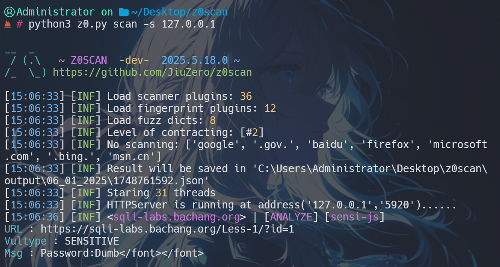
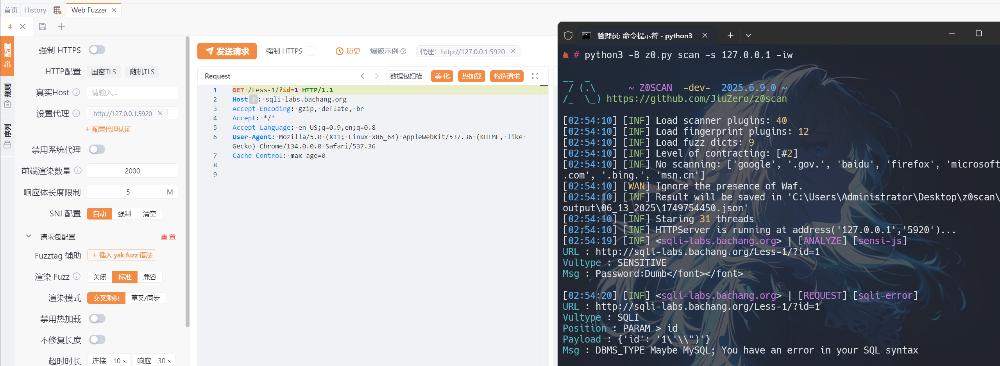
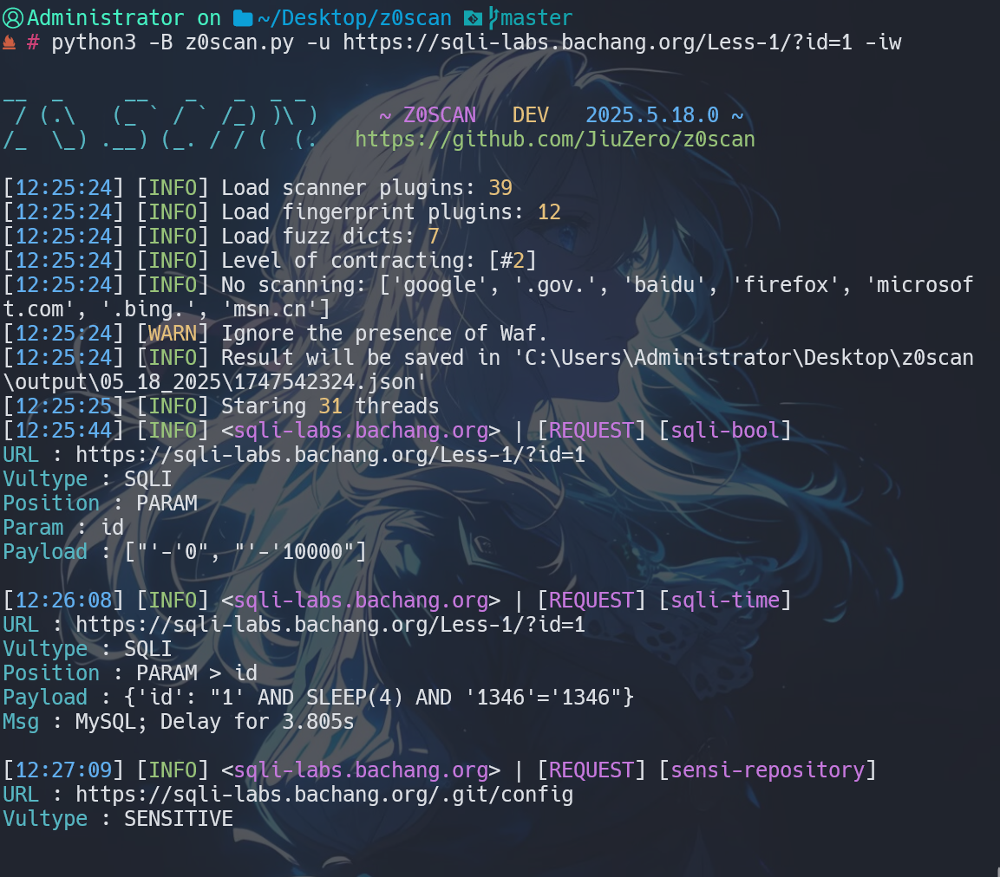

<h4 align="center" dir="auto">
  Chinese | <a href="https://github.com/JiuZero/z0scan/blob/master/README.MD">English</a> | <a href="https://jiuzero.github.io/tags/z0scan/">Documentation</a>
</p>

<p align="center">
  <a href="https://www.python.org/">
      
  <a href="https://github.com/JiuZero/z0scan">
      
  <a href="https://www.gnu.org/licenses/gpl-2.0.en.html">
      
      
  </a>
</p>

## ⚠️ Disclaimer

> If you engage in any illegal activities while using this project and its included tools, you shall bear the corresponding consequences. We assume no legal or joint liability.

> By using this software or otherwise indicating your acceptance of this agreement, you are deemed to have read and agreed to be bound by the terms of this agreement.

## 🌟 Advantages

1. Integration of WAF detection, fingerprint information, and plugin scanning
2. Capable of parsing parameters in complex formats like Json, XML, and pseudo-static parameters (Beta)
3. Provides SQLite3-based storage support for scan records and other data
4. Open-source Python3-based solution with cross-platform support
5. Supports IPV6 domain resolution (Beta)

## 🔧 Installation

Install via **Pypi**
```bash
pip install z0scan
z0
```

Install via **GitHub** clone
```bash
git clone https://github.com/JiuZero/z0scan
cd z0scan
pip install -r requirements.txt
python3 z0.py
```

- For **special environment installations** (Such as Termux), please refer to: [Documentation](https://jiuzero.github.io/tags/z0scan/)  

## 🚀 Usage Examples

### Passive Scanning

Default configuration for `passive scanning` (forward browser traffic to port 5920)
```
z0 scan -s 127.0.0.1:5920
```



Recommended common usage
```
z0 scan -s 127.0.0.1:5920 --risk 0,1,2,3 --level 2 --disable cmdi,unauth
```

### Active Scanning

Default configuration for `active scanning`
```
# Initiate active detection from Burp/Yakit request traffic (recommended)
z0 scan -s 127.0.0.1:5920
```



```
# Direct detection
z0 scan -u https://example.com/?id=1
# Batch detection from URL list
z0 scan -f urls.txt
```



- For more detailed information, please refer to: [Documentation](https://jiuzero.github.io/tags/z0scan/)

## ✨ Plugin List

- PerFile

|Plugin Name|Description|Risk|
|:---:|:----:|:----:|
|sqli-bool|SQL Boolean-based Blind Injection|2|
|sqli-time|SQL Time-based Blind Injection|2|
|sqli-error|SQL Error-based Injection|2|
|codei-asp|ASP Code Execution|3|
|codei-php|PHP Code Execution|3|
|cmdi|Command Execution|3|
|other-objectdese|Deserialization Parameter Analysis|3|
|sensi-js|JS Sensitive Information Leak|0|
|sensi-jsonp|Jsonp Sensitive Information Leak|1|
|sensi-php-realpath|PHP Real Path Disclosure|0|
|redirect|Redirect|1|
|sensi-webpack|webpack Source Code Leak|1|
|other-webdav-passive|Passive webdav Service Discovery|1|
|xpathi-error|Error-based XPATH Injection|2|
|trave-path|Path Traversal|2|
|sensi-backup_1|Backup File Detection (File-based)|1|
|sensi-viewstate|Unencrypted VIEWSTATE Discovery|0|
|xss|XSS Scanning Based on JS Semantics|1|
|crlf_1|CRLF Vulnerability Detection|2|
|cors-passive|CORS Vulnerability Detection (Passive Analysis)|2|
|unauth|Unauthorized Access|2|
|leakpwd-page-passive|Weak Password on Admin Login Page|2|
|sensi-editfile|Editor Backup File Leak|1|
|sensi-sourcecode|Source Code Leak|1|
|captcha-bypass|CAPTCHA Bypass|0|
|sensi-retirejs|Outdated JS Component Detection|-1|
|ssti|SSTI Vulnerability Detection|3|

- PerFolder

|Plugin Name|Description|Risk|
|:---:|:----:|:----:|
|sensi-backup_2|Backup File Scanning (Directory-based)|1|
|trave-list_2|Directory Listing|2|
|sensi-file|Sensitive File Leakage (including phpinfo, .git, etc.)|/|
|upload-oss|OSS Bucket Arbitrary File Upload|2|
|sensi-frontpage|FrontPage Configuration Information Leak|1|

- PerServer

|Plugin Name|Description|Risk|
|:---:|:----:|:----:|
|sensi-errorpage|Error Page Sensitive Information Leak|0|
|xss-net|.NET Universal XSS|1|
|other-dns-zonetransfer|DNS Zone Transfer Vulnerability|1|
|xss-flash|Flash Universal XSS|1|
|other-idea-parse|Idea Directory Parsing|1|
|other-xst|XST Vulnerability Detection|-1|
|other-webdav-active|Active webdav Service Discovery|1|
|upload-put|PUT-based Arbitrary File Upload|3|
|sensi-backup_3|Backup File Detection (Domain-based)|1|
|cors-active|CORS Vulnerability Detection (Active Discovery)|2|
|crlf_3|CRLF Line Injection Vulnerability|2|
|other-hosti|Host Header Injection Attack Detection|1|
|other-oss-takeover|OSS Bucket Takeover Vulnerability|3|
|sensi-iis-shortname|IIS Short Filename Vulnerability|0|
|other-clickjacking|Clickjacking Vulnerability|-1|
|other-baseline|Service Version Disclosure|-1|
|other-smuggling|Request Smuggling Vulnerability|3|
|trave-list_3|Directory Listing|2|

## 🔆 Changelog & License

- Changelog: [CHANGELOG](https://github.com/JiuZero/z0scan/blob/master/doc/CHANGELOG.MD)

- Future: [TODO](https://github.com/JiuZero/z0scan/blob/master/doc/TODO.MD)

- GPL-2.0 License: [LICENSE](https://github.com/JiuZero/z0scan/blob/master/LICENSE)

## 📝 Contact

|Platform|Contact|
|:---:|:----:|
|WeiXin|JiuZer1|
|QQ|1703417187|
|Email|jiuzer0@qq.com|