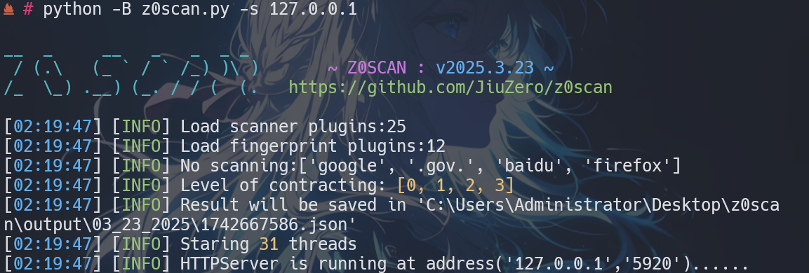

<h1 align="center">
  <br>
  
  <br>
   Z0SCAN
  <br>
</h1>

<h3 align="center">一款风险资产漏洞检测与辅助性的高效主、被动扫描工具.</h4>

<h4 align="center" dir="auto">
  中文 | <a href="https://github.com/JiuZero/z0scan/blob/master/README.MD">English</a>
</p>

<p align="center">
  <a href="https://www.python.org/">
      
  <a href="https://github.com/JiuZero/z0scan">
      
  <a href="https://www.gnu.org/licenses/gpl-2.0.en.html">
      
  </a>
</p>

## 🌟 优势

1. WAF判断、指纹信息与插件扫描的联动
**「更少的WAF触发、更少的请求量、更强的针对性」**

2. 伪静态的支持与其它漏洞的支持
**「更强的漏洞发现能力」**

3. 独特的相似扫描跳过机制
**「更少的请求量」**

4. 辅助发现敏感信息与潜在漏洞
**「具备辅助能力」**

5. 以SQLite3提供扫描记录等数据储存支持
**「大规模、高效」**

6. 基于Python3开源
**「高自定义」**

## 🔧 安装

**cryptography**依赖适配性安装（可选）：
|环境|命令|
|:---:|:----:|
|Debian/Ubuntu| ```apt install python-cryptography``` |
|Termux| ```pkg install python-cryptography``` |
|Alpine/iSH| ```apk add py3-cryptography``` |

通过**Pypi**安装
```bash
pip install z0scan
z0scan
```

通过**GitHub**克隆安装
```bash
git clone https://github.com/JiuZero/z0scan
cd z0scan
pip install -r requirements.txt
python3 z0scan.py
```

## 🚀 使用

```
usage: z0scan [options]

options:
  -h, --help            show this help message and exit
  -v, --version         Show program's version number and exit
  --debug               Show programs's exception
  -l LEVEL, --level LEVEL
                        Different level use different kind of scanner
                        (Default [0, 1, 2, 3])

Proxy:
  Passive Agent Mode Options

  -s SERVER_ADDR, --server-addr SERVER_ADDR
                        Server addr format:(ip:port)

Target:
  Options has to be provided to define the target(s)

  -u URL, --url URL     Target URL (e.g. "http://www.site.com/vuln.php?id=1")
  -f URL_FILE, --file URL_FILE
                        Scan multiple targets given in a textual file

Request:
  Network request options

  -p PROXY, --proxy PROXY
                        Use a proxy to connect to the target URL,Support
                        http,https,socks5,socks4 eg:http@127.0.0.1:8080 or
                        socks5@127.0.0.1:1080
  --timeout TIMEOUT     Seconds to wait before timeout connection (Default
                        10)
  --retry RETRY         Time out retrials times (Default 2)
  --random-agent        Use randomly selected HTTP User-Agent header value

Output:
  Output options

  --html                When selected, the output will be output to the
                        output directory by default, or you can specify
  --json JSON           The json file is generated by default in the output
                        directory, you can change the path

Optimization:
  Optimization options

  -t THREADS, --threads THREADS
                        Max number of concurrent network requests (Default
                        31)
  -iw, --ignore-waf     Ignore the WAF during detection
  -sc, --scan-cookie    Scan cookie during detection
  --disable DISABLE     Disable some plugins (e.g. --disable
                        SQLiBool,SQLiTime)
  --able ABLE           Enable some moudle (e.g. --enable SQLiBool,SQLiTime)
```

## ⚡️插件列表

- PerFile

|插件名称|插件简述|
|:---:|:----:|
|SQLiBool|SQL布尔盲注检测|
|SQLiTime|SQL时间盲注检测|
|SQLiError|SQL报错注入检测|
|AspCodei|Asp代码执行|
|PhpCodei|Php代码执行|
|Cmdi|命令执行|
|ObjectDese|反序列参数分析|
|JsSensi|Js敏感信息泄露|
|Jsonp|Js敏感信息泄露|
|PhpRealPath|Php真实目录发现|
|Redirect|重定向|
|XpathiError|基于报错的XPATH注入检测|
|PathTrave|路径穿越|

- PerFolder

|插件名称|插件简述|
|:---:|:----:|
|BackupFolder|备份文件扫描|
|DirTrave|目录遍历|
|RepositoryLeak|仓库源码泄漏|
|Phpinfo|Phpinfo文件发现|

- PerServer

|插件名称|插件简述|
|:---:|:----:|
|IISShortname|IIS短文件名漏洞检测|
|IISNginxParse|IIS与Nginx服务解析漏洞|
|ErrorPage|错误页敏感信息泄露|
|OSSTakeover|OSS储存桶接管|
|NetXSS|.NET通杀XSS|
|NginxCRLF|Nginx服务CRLF注入|
|NginxWebcache|Nginx错误配置-缓存清除|
|FlashXSS|Flash通杀XSS|
|NginxVariableLeakage|Nginx错误配置-变量读取|
|IdeaParse|Idea目录解析|
|BackupDomain|基于域名的备份文件检测|

- 插件编写规范请见：
[DEV.MD](https://github.com/JiuZero/z0scan/blob/master/doc/DEV.MD)

## ✨ 参考

在开发z0scan的过程中借鉴了大量的项目，它们包括但不限于：
```
- [w13scan](https://github.com/w-digital-scanner/w13scan)
- [sqlmap](https://github.com/sqlmapproject/sqlmap)
- [Vxscan](https://github.com/al0ne/Vxscan)
- [Sitadel](https://github.com/shenril/Sitadel)
etc…
```

- 清单详情请见 [这里](https://github.com/JiuZero/z0scan/blob/master/doc/THANKS.MD)

## 🔆 更新日记 & 许可

- 更新日记：[CHANGELOG](https://github.com/JiuZero/z0scan/blob/master/doc/CHANGE.MD)

- GPL-2.0授权许可：[LICENSE](https://github.com/JiuZero/z0scan/blob/master/LICENSE)

## ❤️ 联系

|平台|联系|
|:---:|:----:|
|QQ|3973580951|
|Email|jiuzer0@qq.com|
|WeiXin|JiuZer0|
