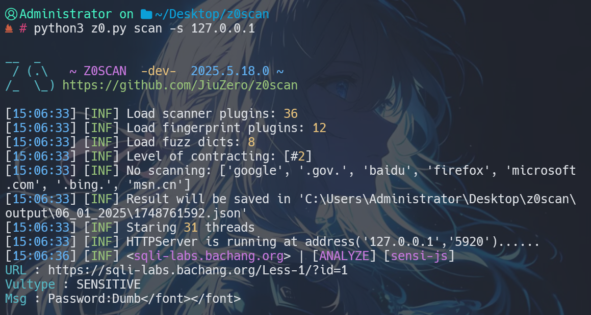
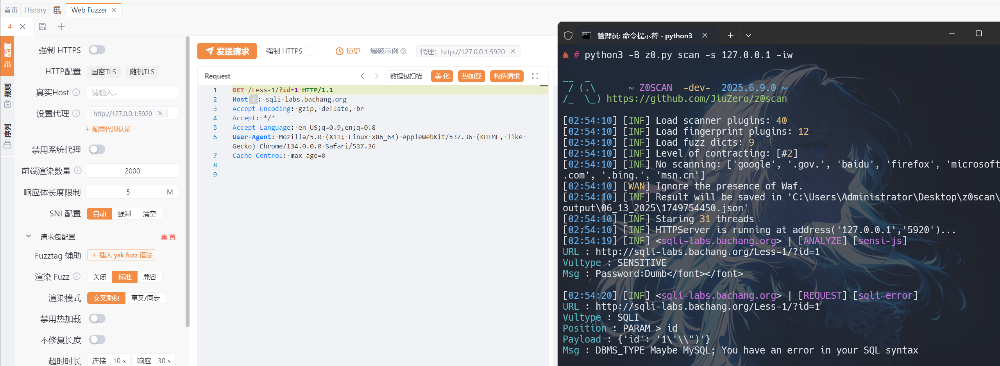
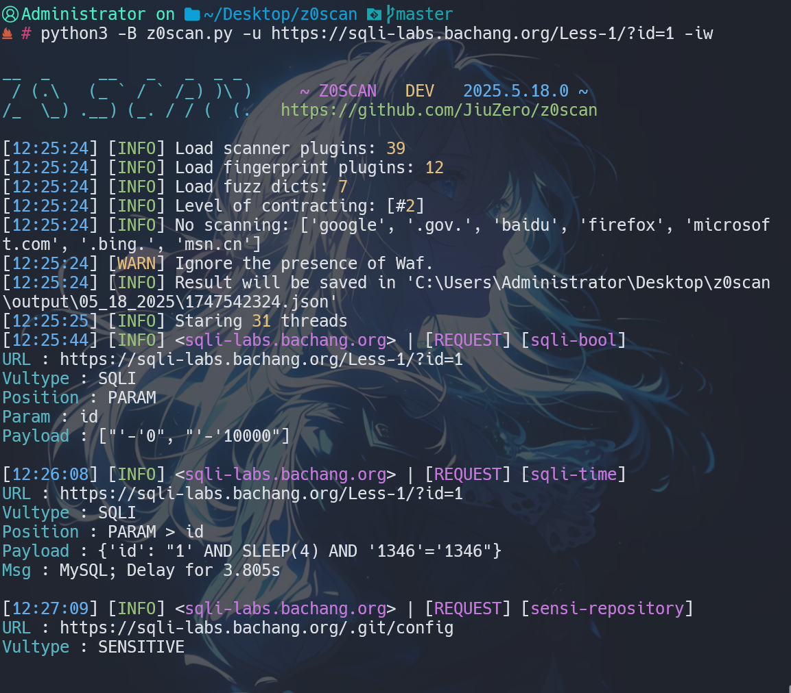

<h4 align="center" dir="auto">
  中文 | <a href="https://github.com/JiuZero/z0scan/blob/master/README.MD">English</a> | <a href="https://jiuzero.github.io/tags/z0scan/">文档</a>
</p>

<p align="center">
  <a href="https://www.python.org/">
      
  <a href="https://github.com/JiuZero/z0scan">
      
  <a href="https://www.gnu.org/licenses/gpl-2.0.en.html">
      
      
  </a>
</p>

## ⚠️ 免责声明

> 如您在使用本项目及包含工具的过程中存在任何非法行为，您需自行承担相应后果，我们将不承担任何法律及连带责任。

> 您的使用行为或者您以其他任何明示或者默示方式表示接受本协议的，即视为您已阅读并同意本协议的约束。

## 🌟 优势

1. WAF判断、指纹信息与插件扫描的联动
2. 能够解析Json、XML等复杂格式中的参数及伪静态参数（Beta）
3. 以SQLite3提供扫描记录等数据储存支持
4. 基于Python3开源并提供全平台支持
5. 支持IPV6解析域名（Beta）

## 🔧 安装

通过**Pypi**安装
```bash
pip install z0scan
z0
```

通过**GitHub**克隆安装
```bash
git clone https://github.com/JiuZero/z0scan
cd z0scan
pip install -r requirements.txt
python3 z0.py
```

## 🚀 使用示例

### 被动扫描

默认配置下`被动扫描`（浏览器转发流量到5920端口）
```
z0 scan -s 127.0.0.1:5920
```



常用推荐
```
z0 scan -s 127.0.0.1:5920 --risk 0,1,2,3 --level 2 --disable cmdi,unauth
```

### 主动扫描

默认配置下`主动扫描`
```
# 由Burp/Yakit发起请求流量的主动检测（推荐）
z0 scan -s 127.0.0.1:5920
```



```
# 直接检测
z0 scan -u https://example.com/?id=1
# 遍历URL列表检测
z0 scan -f urls.txt
```



- 获取更加详细的信息，请见：[文档](https://jiuzero.github.io/tags/z0scan/)

## ✨ ️插件列表

- PerFile

|插件名称|插件简述|Risk|
|:---:|:----:|:----:|
|sqli-bool|SQL布尔盲注检测|2|
|sqli-time|SQL时间盲注检测|2|
|sqli-error|SQL报错注入检测|2|
|codei-asp|Asp代码执行|3|
|codei-php|Php代码执行|3|
|cmdi|命令执行|3|
|other-objectdese|反序列参数分析|3|
|sensi-js|Js敏感信息泄露|0|
|sensi-jsonp|Jsonp敏感信息泄露|1|
|sensi-php-realpath|Php真实目录发现|0|
|redirect|重定向|1|
|sensi-webpack|webpack源码泄露|1|
|other-webdav-passive|webdav服务被动发现|1|
|xpathi-error|基于报错的XPATH注入检测|2|
|trave-path|路径穿越|2|
|sensi-backup|基于文件的备份文件检测|1|
|sensi-viewstate|未加密的VIEWSTATE发现|0|
|xss|基于JS语义的XSS扫描|1|
|crlf|CRLF漏洞检测|2|
|cors-passive|CORS漏洞检测（被动分析）|2|
|unauth|未授权访问漏洞|2|
|leakpwd-page-passive|后台登陆页弱口令|2|
|sensi-editfile|编辑器备份文件泄露|1|
|sensi-sourcecode|源码泄露|1|

- PerFolder

|插件名称|插件简述|Risk|
|:---:|:----:|:----:|
|sensi-backup|基于各级目录的备份文件扫描|1|
|trave-list|目录浏览|2|
|sensi-repository|仓库源码泄漏|1|
|sensi-php-phpinfo|Phpinfo文件发现|0|
|upload-oss|OSS储存桶任意文件上传|2|

- PerServer

|插件名称|插件简述|Risk|
|:---:|:----:|:----:|
|sensi-errorpage|错误页敏感信息泄露|0|
|xss-net|.NET通杀XSS|1|
|other-dns-zonetransfer|DNS域传送漏洞|1|
|xss-flash|Flash通杀XSS|1|
|other-idea-parse|Idea目录解析|1|
|other-xst|XST漏洞检测|-1|
|other-webdav-active|webdav服务发现|1|
|upload-put|基于PUT请求的任意文件上传|3|
|sensi-backup|基于域名的备份文件检测|1|
|cors-active|CORS漏洞检测（主动发现）|2|
|crlf|CRLF换行注入漏洞|2|
|other-hosti|Host头注入攻击检测|1|
|other-oss-takeover|OSS储存桶接管漏洞|3|
|sensi-iis-shortname|IIS短文件名漏洞|0|

## 🎯 不足

- [ ] 缺乏内置的爬虫方案
- [ ] Python代码效率低（Codon？）
- [ ] 重复检测问题（更高的去重需求）

## 🔆 更新日记 & 许可

- 更新日记：[CHANGELOG](https://github.com/JiuZero/z0scan/blob/master/doc/CHANGELOG.MD)

- GPL-2.0授权许可：[LICENSE](https://github.com/JiuZero/z0scan/blob/master/LICENSE)

## 📝 联系

|平台|联系|
|:---:|:----:|
|WeiXin|JiuZer1|
|QQ|1703417187|
|Email|jiuzer0@qq.com|